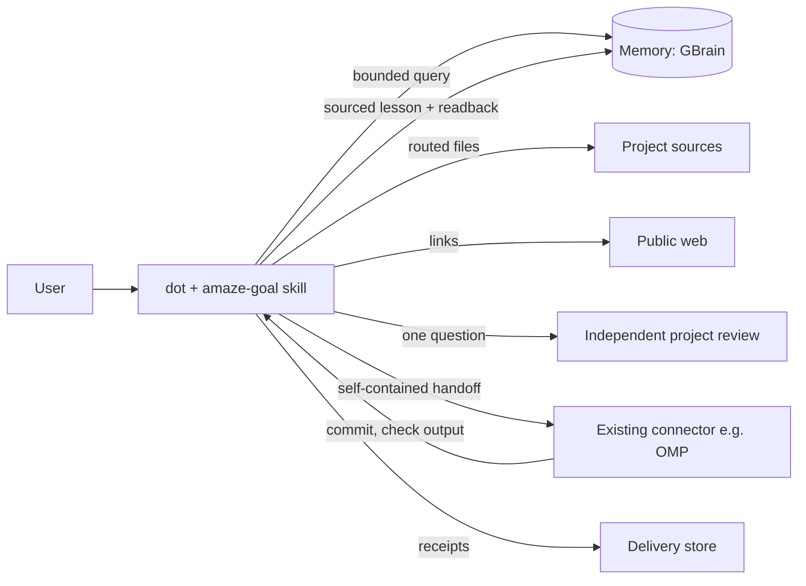

# Architecture

amaze-agi is a content package plus an optional helper. Dot is the control tower; connectors execute; the platform and connectors enforce permissions.

## Three phases

1. **Light intent, conditional plan.** Bind outcome, scope, finish line, constraints, source needs, reporting. Pick only the jobs that help; run independent ones in parallel with explicit outputs and budgets; merge by evidence, not by agreement.
2. **Verified execution.** Confirm target and acting session/model before writes; one writer per resource; self-contained handoffs; UNKNOWN reconciled before retry; user cancellation stops dependent work.
3. **Review, delivery, learning.** Review immutable results under the latest user-approved criteria; separate upload and attach receipts; save sourced lessons and read them back; stop at the finish line.

## Components

| Component | Role | Not |
| --- | --- | --- |
| `plugins/amaze-agi/skills/amaze-goal/` | procedure dot follows | not authority, not a permission source |
| `project-sources/`, `third_party/`, `config/research-routing.json` | pinned, licensed reference sources and exact routing | not installed capabilities |
| helper CLI (`src/`, `bin/`) | local job ledger, readbacks, quote/anchor and source checks | not an executor, scheduler, server or hook |
| connectors (OMP, GBrain, Drive, apps) | execution, memory and delivery under their own permissions | not modified by this repository |

## Helper ledger semantics

- **Criteria revisions**: revision 1 starts unapproved; any revision takes effect only after `goal approve` with a confirmation containing `approve rN <hash8>`, binding the exact criteria. This checks the relayed reply; it is not user authentication. Evidence recorded under an older revision is stale.
- **Closure**: judged against the latest approved revision. Local probes (file, JSON, HTTP, allow-listed command) run at close time and are *executed*; `receipt` criteria are satisfied by a recorded `connector_readback` and are *attested*. Closure is refused while a newer revision awaits approval, a task is open, or a run is unresolved.
- **Runs**: a handoff is a record, not an execution. `unknown` blocks further handoffs for that task until `run reconcile`; replies after a terminal state become late observations.
- **Deliveries**: upload verified only on matching SHA-256; attach verified only with a listing after a verified upload; unknown parts reconcile first.
- **Storage**: append-only journal under `<project>/.amaze-agi/` with a writer lock; read commands never create files.

## Evidence levels

`claimed` < `read_observed` < `source_verified` (deterministic quote/path/span match) < `executed_test` (local probe). Callers may assert only `claimed` or `read_observed`; stronger levels come from the helper's validators. Defect, runtime and reasoning claims built on a quote stay below verified.
